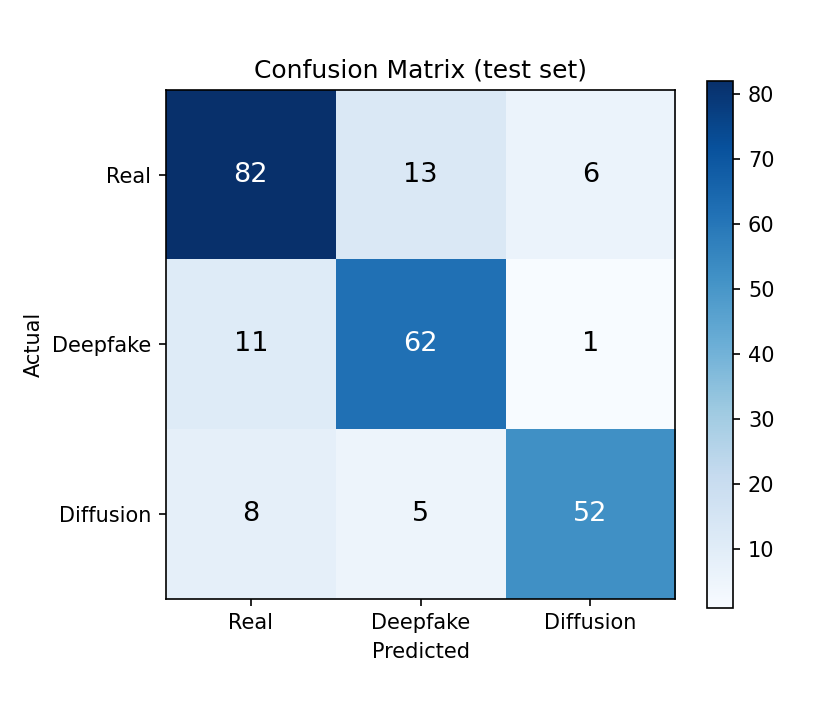
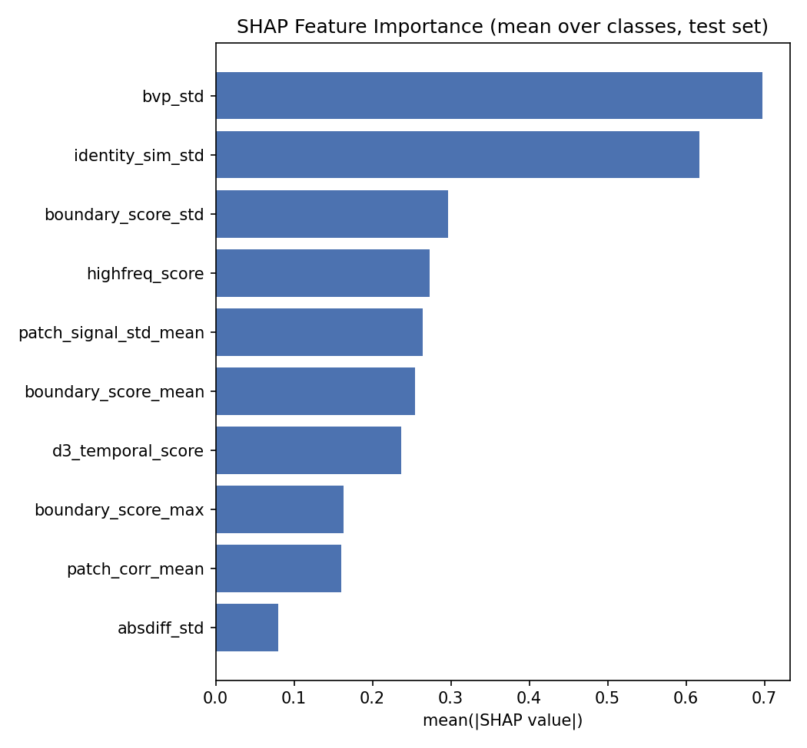
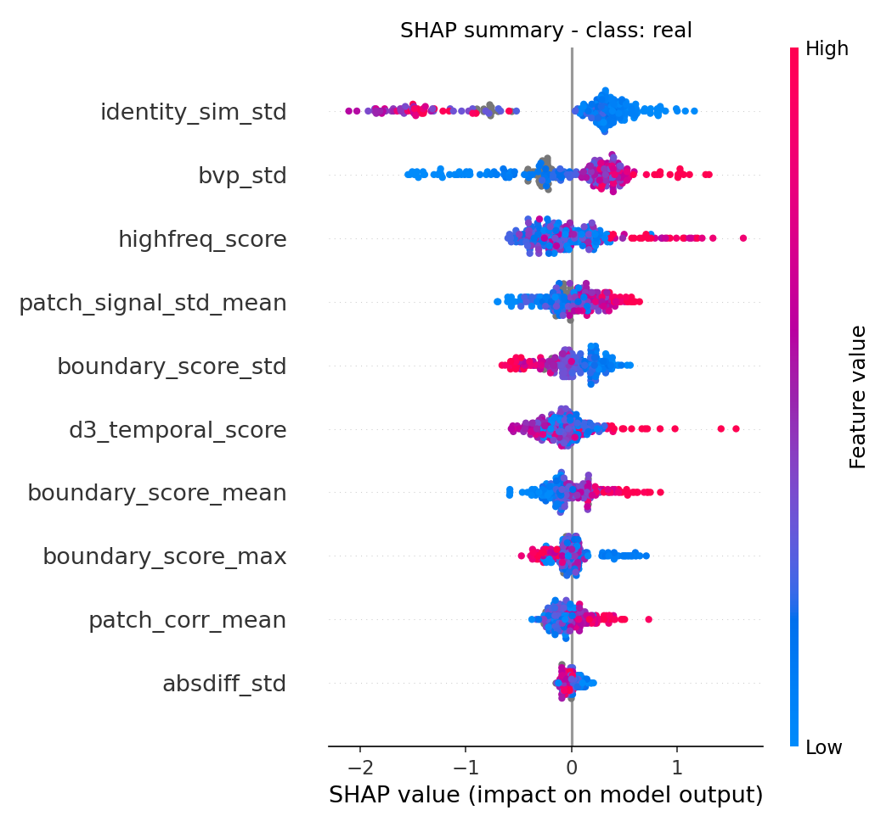
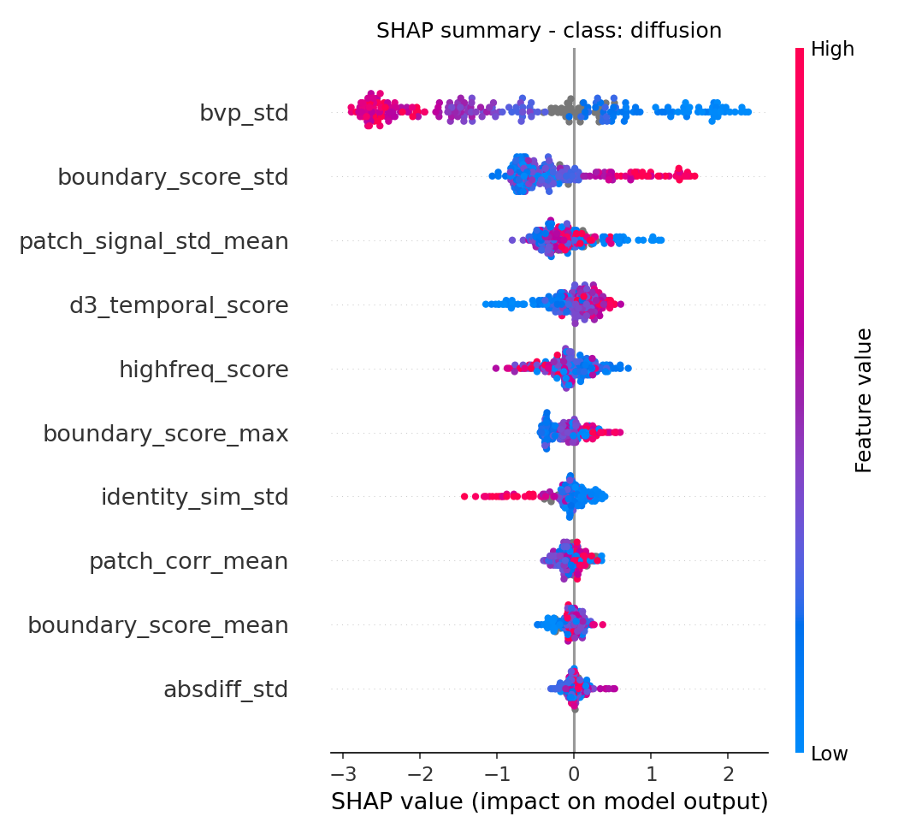
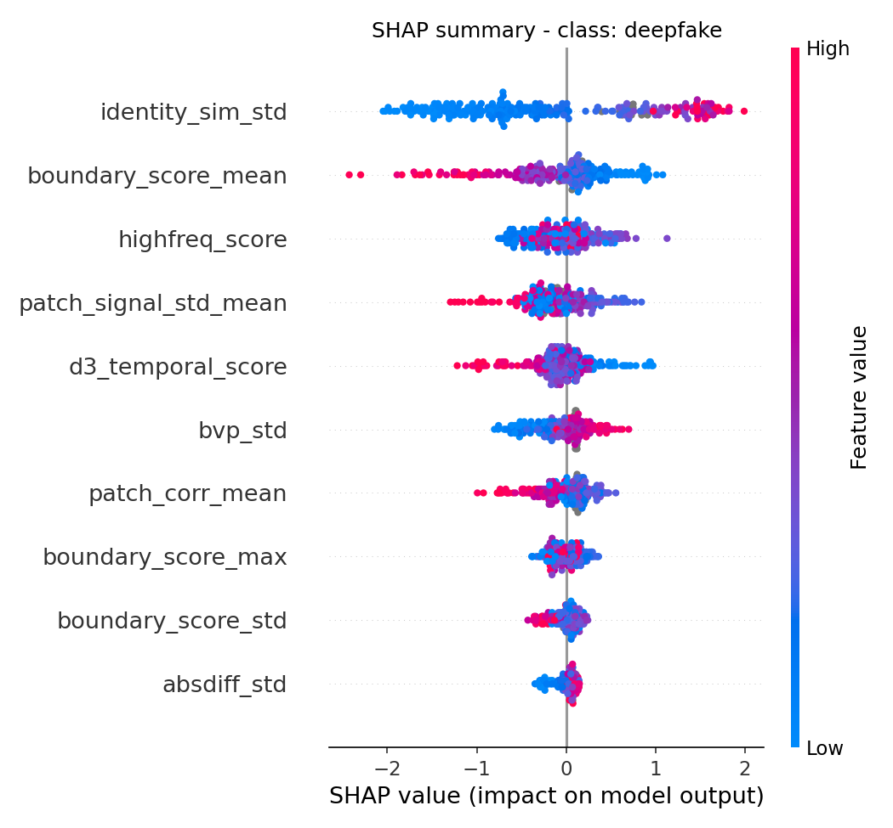

# train_classifier2 Experiment Results

생성 시각: 2026-09-17 22:18:47

## 1. Experiment Setup

- Task: Real / Deepfake / Diffusion 3-class Classification
- Dataset: `results\unified_features_20260911_024351.csv`
- Model: XGBoost (multi:softprob, n_estimators=300, max_depth=4, lr=0.05)
- Class Weight: balanced sample weight
- Features: 고정 10개 (select_features.py 선별 결과)
- Validation: train 내부 5-Fold Stratified CV
- Test Set: 최종 평가에만 1회 사용
- Total Samples: 800
- Train / Test: 560 / 240

클래스별 샘플 수

| Class | Total | Train | Test |
|---|---:|---:|---:|
| Real | 335 | 234 | 101 |
| Deepfake | 248 | 174 | 74 |
| Diffusion | 217 | 152 | 65 |

## 2. Features

- absdiff_std
- bvp_std
- d3_temporal_score
- highfreq_score
- patch_corr_mean
- patch_signal_std_mean
- boundary_score_mean
- boundary_score_std
- boundary_score_max
- identity_sim_std

**총 feature 수: 10개**

## 3. Train CV Performance

| Metric | Score |
|---|---:|
| Accuracy | 0.7500 |
| Macro Precision | 0.7519 |
| Macro Recall | 0.7539 |
| Macro F1 | 0.7528 |
| Weighted Precision | 0.7499 |
| Weighted Recall | 0.7500 |
| Weighted F1 | 0.7499 |
| Macro AUC | 0.8949 |
| Weighted AUC | 0.8895 |

## 4. Final Model Performance (test set)

| Metric | Score |
|---|---:|
| Accuracy | 0.8167 |
| Macro Precision | 0.8227 |
| Macro Recall | 0.8166 |
| Macro F1 | 0.8186 |
| Weighted Precision | 0.8193 |
| Weighted Recall | 0.8167 |
| Weighted F1 | 0.8171 |
| Macro AUC | 0.9164 |
| Weighted AUC | 0.9136 |

## 5. Per-Class Performance

| class | precision | recall | f1_score | support |
|---|---:|---:|---:|---:|
| Real | 0.8119 | 0.8119 | 0.8119 | 101 |
| Deepfake | 0.7750 | 0.8378 | 0.8052 | 74 |
| Diffusion | 0.8814 | 0.8000 | 0.8387 | 65 |
| Macro Avg | 0.8227 | 0.8166 | 0.8186 | 240 |
| Weighted Avg | 0.8193 | 0.8167 | 0.8171 | 240 |

```text
              precision    recall  f1-score   support

        Real      0.812     0.812     0.812       101
    Deepfake      0.775     0.838     0.805        74
   Diffusion      0.881     0.800     0.839        65

    accuracy                          0.817       240
   macro avg      0.823     0.817     0.819       240
weighted avg      0.819     0.817     0.817       240
```

## 6. Confusion Matrix

| Actual \ Predicted | Real | Deepfake | Diffusion |
|---|---:|---:|---:|
| Real | 82 | 13 | 6 |
| Deepfake | 11 | 62 | 1 |
| Diffusion | 8 | 5 | 52 |



## 7. SHAP Feature Importance

| rank | feature | mean_abs_shap |
|---|---:|---:|
| 1 | bvp_std | 0.6975 |
| 2 | identity_sim_std | 0.6172 |
| 3 | boundary_score_std | 0.2967 |
| 4 | highfreq_score | 0.2732 |
| 5 | patch_signal_std_mean | 0.2643 |
| 6 | boundary_score_mean | 0.2541 |
| 7 | d3_temporal_score | 0.2365 |
| 8 | boundary_score_max | 0.1633 |
| 9 | patch_corr_mean | 0.1602 |
| 10 | absdiff_std | 0.0800 |



### 클래스별 mean |SHAP|

| feature | mean_abs_shap_real | mean_abs_shap_diffusion | mean_abs_shap_deepfake | mean_abs_shap_overall |
|---|---:|---:|---:|---:|
| bvp_std | 0.4607 | 1.3960 | 0.2357 | 0.6975 |
| identity_sim_std | 0.6780 | 0.1941 | 0.9795 | 0.6172 |
| boundary_score_std | 0.2117 | 0.5672 | 0.1111 | 0.2967 |
| highfreq_score | 0.3022 | 0.2257 | 0.2916 | 0.2732 |
| patch_signal_std_mean | 0.2138 | 0.2890 | 0.2900 | 0.2643 |
| boundary_score_mean | 0.1879 | 0.1053 | 0.4693 | 0.2541 |
| d3_temporal_score | 0.1962 | 0.2524 | 0.2610 | 0.2365 |
| boundary_score_max | 0.1484 | 0.2042 | 0.1372 | 0.1633 |
| patch_corr_mean | 0.1402 | 0.1242 | 0.2162 | 0.1602 |
| absdiff_std | 0.0639 | 0.0809 | 0.0954 | 0.0800 |





## 8. Summary

- 고정 feature 10개로 train 560 / test 240 를 사용했다.
- train 내부 CV Macro F1 은 0.7528, Macro AUC 는 0.8949 였다.
- test Accuracy 는 0.8167, Macro F1 은 0.8186, Macro AUC 는 0.9164 를 기록했다.
- SHAP 에서 가장 영향력이 높은 feature 는 `bvp_std` (mean |SHAP| = 0.6975) 였다.
