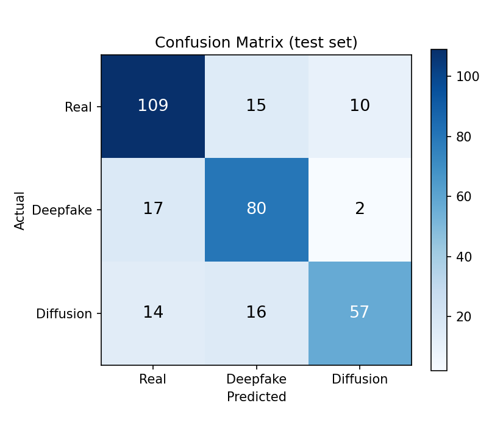
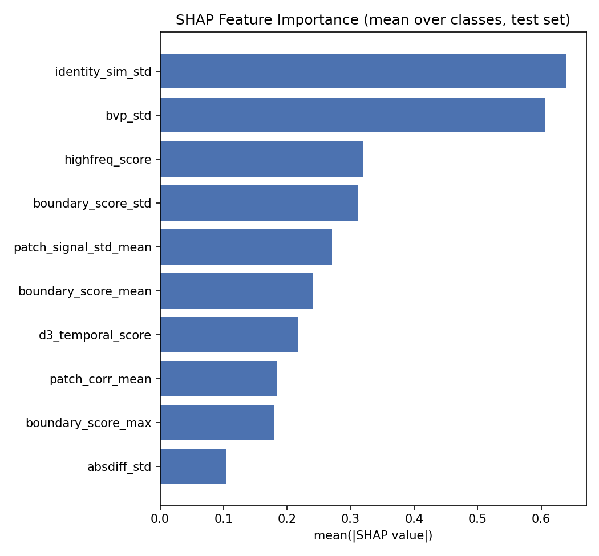
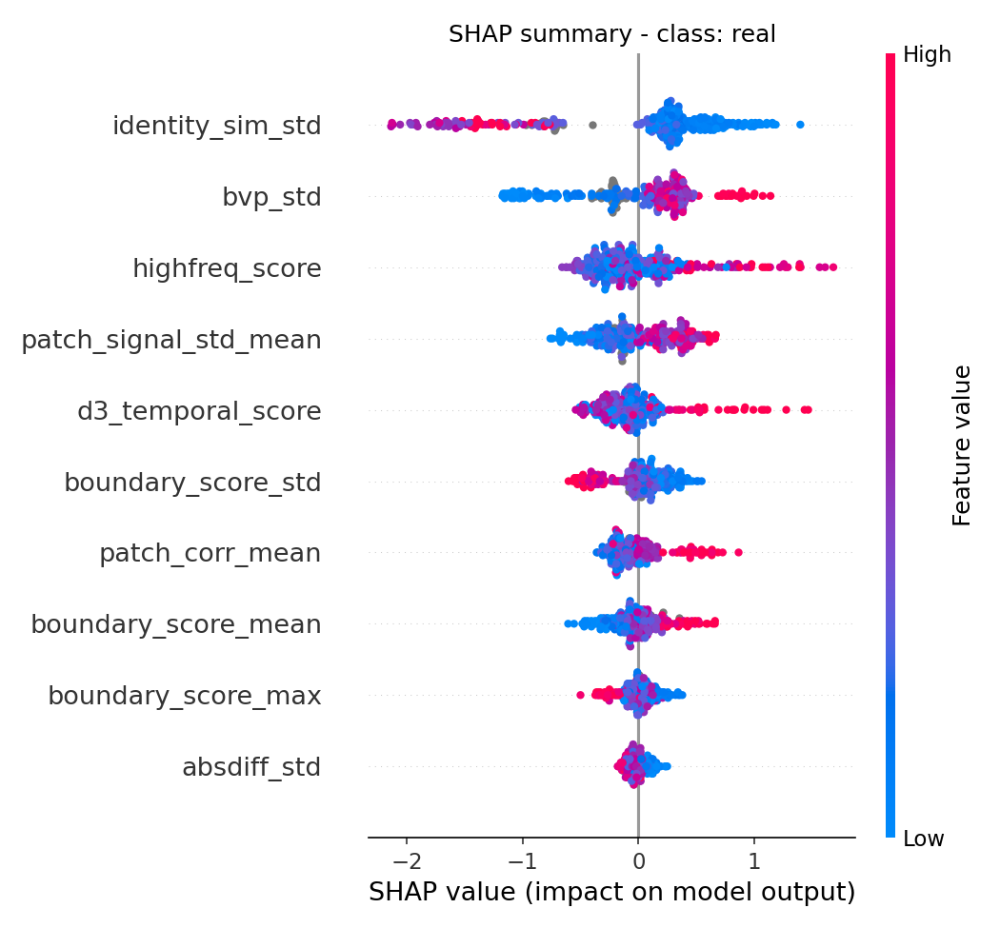
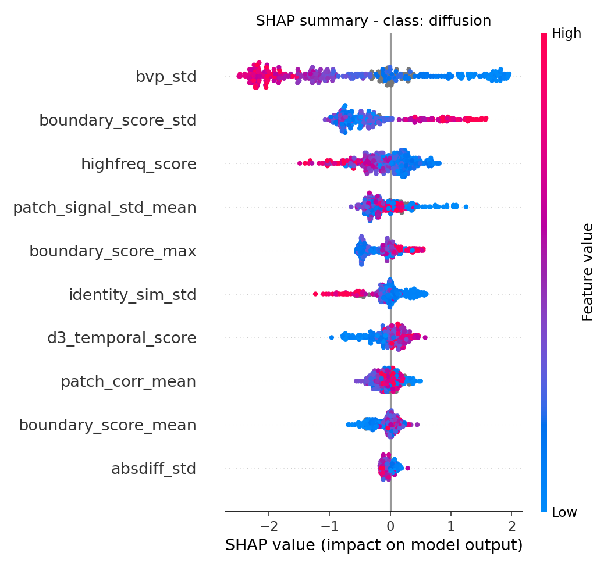
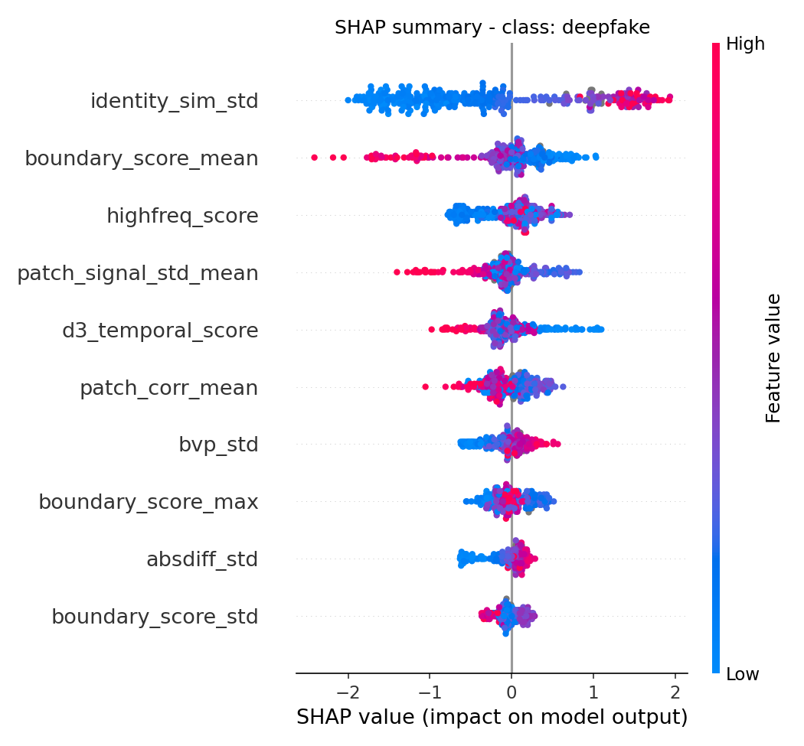

# train_classifier2 Experiment Results

생성 시각: 2026-09-17 22:19:05

## 1. Experiment Setup

- Task: Real / Deepfake / Diffusion 3-class Classification
- Dataset: `results\unified_features_20260911_024351.csv`
- Model: XGBoost (multi:softprob, n_estimators=300, max_depth=4, lr=0.05)
- Class Weight: balanced sample weight
- Features: 고정 10개 (select_features.py 선별 결과)
- Validation: train 내부 5-Fold Stratified CV
- Test Set: 최종 평가에만 1회 사용
- Total Samples: 800
- Train / Test: 480 / 320

클래스별 샘플 수

| Class | Total | Train | Test |
|---|---:|---:|---:|
| Real | 335 | 201 | 134 |
| Deepfake | 248 | 149 | 99 |
| Diffusion | 217 | 130 | 87 |

## 2. Features

- absdiff_std
- bvp_std
- d3_temporal_score
- highfreq_score
- patch_corr_mean
- patch_signal_std_mean
- boundary_score_mean
- boundary_score_std
- boundary_score_max
- identity_sim_std

**총 feature 수: 10개**

## 3. Train CV Performance

| Metric | Score |
|---|---:|
| Accuracy | 0.7396 |
| Macro Precision | 0.7403 |
| Macro Recall | 0.7408 |
| Macro F1 | 0.7400 |
| Weighted Precision | 0.7415 |
| Weighted Recall | 0.7396 |
| Weighted F1 | 0.7400 |
| Macro AUC | 0.8884 |
| Weighted AUC | 0.8847 |

## 4. Final Model Performance (test set)

| Metric | Score |
|---|---:|
| Accuracy | 0.7688 |
| Macro Precision | 0.7751 |
| Macro Recall | 0.7589 |
| Macro F1 | 0.7628 |
| Weighted Precision | 0.7736 |
| Weighted Recall | 0.7688 |
| Weighted F1 | 0.7676 |
| Macro AUC | 0.9098 |
| Weighted AUC | 0.9087 |

## 5. Per-Class Performance

| class | precision | recall | f1_score | support |
|---|---:|---:|---:|---:|
| Real | 0.7786 | 0.8134 | 0.7956 | 134 |
| Deepfake | 0.7207 | 0.8081 | 0.7619 | 99 |
| Diffusion | 0.8261 | 0.6552 | 0.7308 | 87 |
| Macro Avg | 0.7751 | 0.7589 | 0.7628 | 320 |
| Weighted Avg | 0.7736 | 0.7688 | 0.7676 | 320 |

```text
              precision    recall  f1-score   support

        Real      0.779     0.813     0.796       134
    Deepfake      0.721     0.808     0.762        99
   Diffusion      0.826     0.655     0.731        87

    accuracy                          0.769       320
   macro avg      0.775     0.759     0.763       320
weighted avg      0.774     0.769     0.768       320
```

## 6. Confusion Matrix

| Actual \ Predicted | Real | Deepfake | Diffusion |
|---|---:|---:|---:|
| Real | 109 | 15 | 10 |
| Deepfake | 17 | 80 | 2 |
| Diffusion | 14 | 16 | 57 |



## 7. SHAP Feature Importance

| rank | feature | mean_abs_shap |
|---|---:|---:|
| 1 | identity_sim_std | 0.6390 |
| 2 | bvp_std | 0.6058 |
| 3 | highfreq_score | 0.3198 |
| 4 | boundary_score_std | 0.3118 |
| 5 | patch_signal_std_mean | 0.2708 |
| 6 | boundary_score_mean | 0.2406 |
| 7 | d3_temporal_score | 0.2181 |
| 8 | patch_corr_mean | 0.1835 |
| 9 | boundary_score_max | 0.1798 |
| 10 | absdiff_std | 0.1045 |



### 클래스별 mean |SHAP|

| feature | mean_abs_shap_real | mean_abs_shap_diffusion | mean_abs_shap_deepfake | mean_abs_shap_overall |
|---|---:|---:|---:|---:|
| identity_sim_std | 0.6843 | 0.2196 | 1.0130 | 0.6390 |
| bvp_std | 0.4018 | 1.2237 | 0.1918 | 0.6058 |
| highfreq_score | 0.3139 | 0.3527 | 0.2927 | 0.3198 |
| boundary_score_std | 0.1932 | 0.6228 | 0.1194 | 0.3118 |
| patch_signal_std_mean | 0.2752 | 0.2784 | 0.2587 | 0.2708 |
| boundary_score_mean | 0.1612 | 0.1559 | 0.4048 | 0.2406 |
| d3_temporal_score | 0.2080 | 0.2015 | 0.2449 | 0.2181 |
| patch_corr_mean | 0.1672 | 0.1600 | 0.2232 | 0.1835 |
| boundary_score_max | 0.1007 | 0.2556 | 0.1832 | 0.1798 |
| absdiff_std | 0.0687 | 0.0764 | 0.1685 | 0.1045 |





## 8. Summary

- 고정 feature 10개로 train 480 / test 320 를 사용했다.
- train 내부 CV Macro F1 은 0.7400, Macro AUC 는 0.8884 였다.
- test Accuracy 는 0.7688, Macro F1 은 0.7628, Macro AUC 는 0.9098 를 기록했다.
- SHAP 에서 가장 영향력이 높은 feature 는 `identity_sim_std` (mean |SHAP| = 0.6390) 였다.
