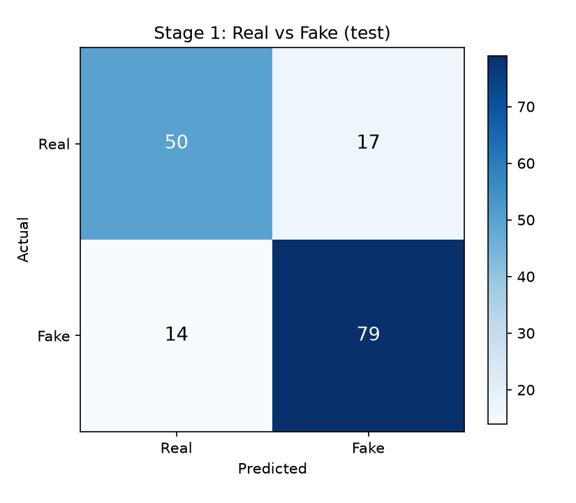
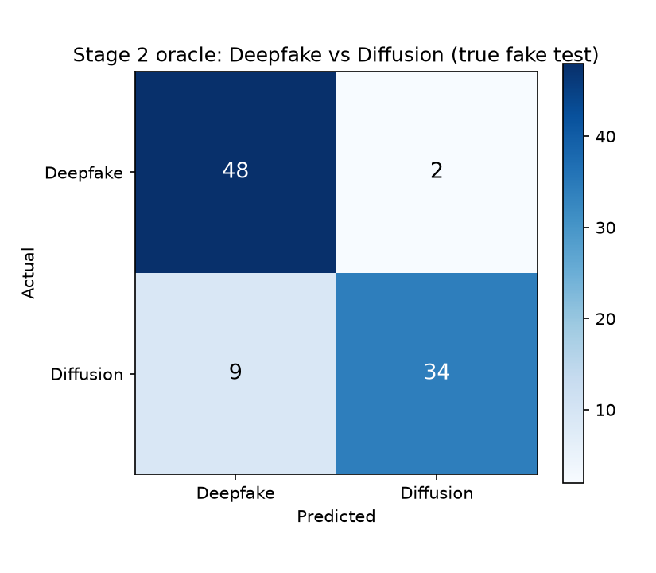
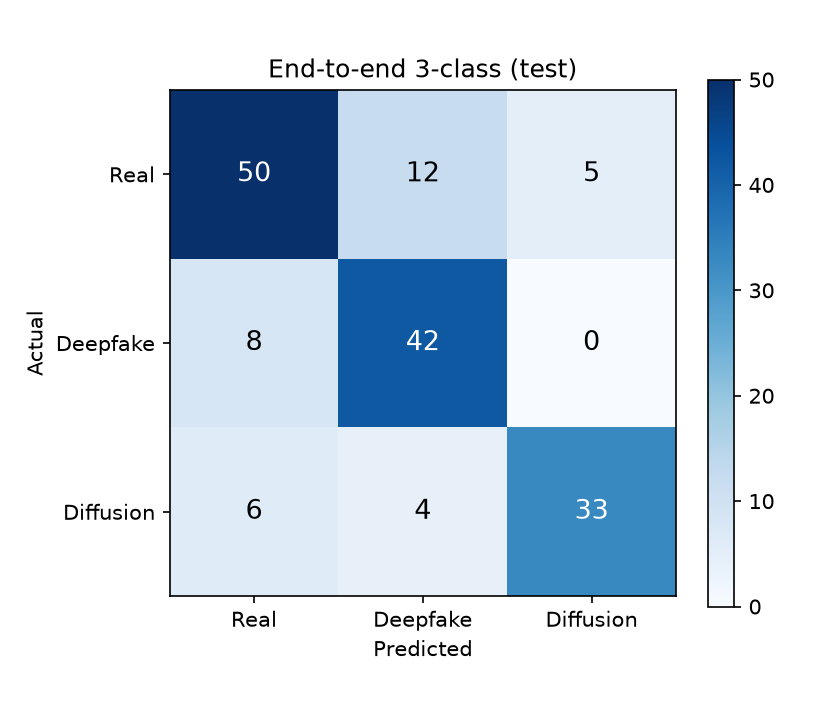
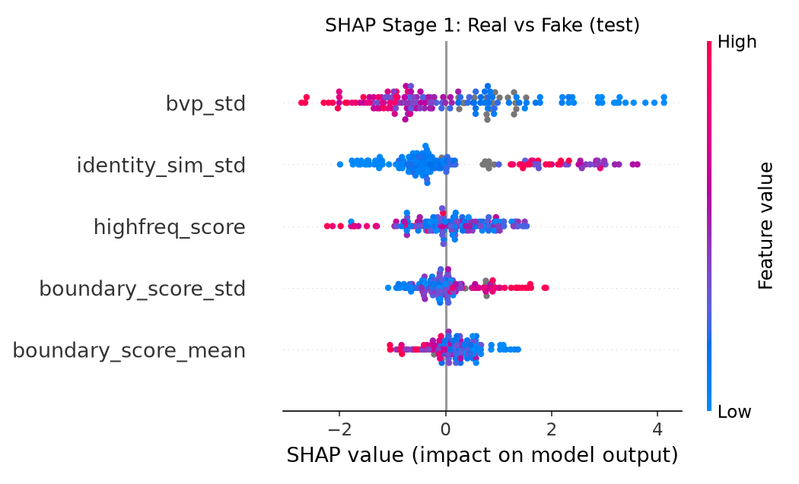
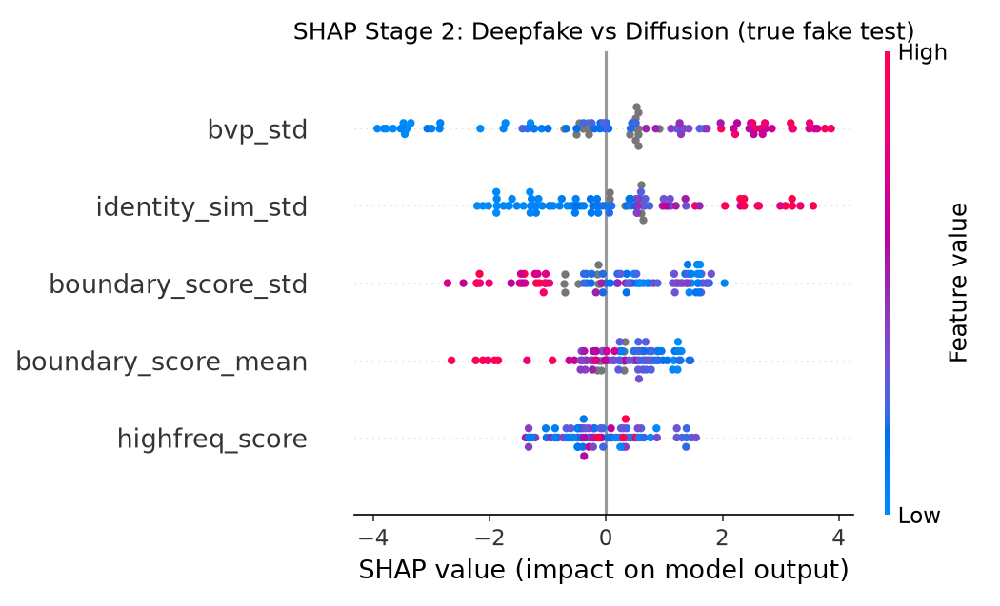

# train_classifier2 Hierarchical Experiment Results

생성 시각: 2026-09-22 22:56:30

## 1. Experiment Setup

- Task: Hierarchical 2-stage classification
  - Stage 1: Real vs Fake
  - Stage 2: Deepfake vs Diffusion (only if Stage 1 predicts fake)
- Dataset: `results/unified_features_20260911_024351.csv`
- Model: XGBoost binary:logistic x 2 (n_estimators=300, max_depth=4, lr=0.05)
- Stage 1 features (5개): identity_sim_std, bvp_std, highfreq_score, boundary_score_mean, boundary_score_std
- Stage 2 features (5개): bvp_std, identity_sim_std, boundary_score_std, boundary_score_mean, highfreq_score
- Labels / train-test split: `train_classifier2.py` 와 동일
- Fake threshold: 0.45
- Class Weight: balanced sample weight + {'fake': 1.0}
- Validation: train 내부 5-Fold Stratified CV
- Test Set: 최종 평가에만 1회 사용
- Total Samples: 800
- Train / Test: 640 / 160

클래스별 샘플 수

| Class | Total | Train | Test |
|---|---:|---:|---:|
| Real | 335 | 268 | 67 |
| Deepfake | 248 | 198 | 50 |
| Diffusion | 217 | 174 | 43 |

## 2. Features

### Stage 1

- identity_sim_std
- bvp_std
- highfreq_score
- boundary_score_mean
- boundary_score_std

### Stage 2

- bvp_std
- identity_sim_std
- boundary_score_std
- boundary_score_mean
- highfreq_score

## 3. Train CV Performance

### 3.1 Stage 1 (real vs fake)

| Metric | Score |
|---|---:|
| Accuracy | 0.7922 |
| Macro Precision | 0.7881 |
| Macro Recall | 0.7821 |
| Macro F1 | 0.7845 |
| Weighted Precision | 0.7912 |
| Weighted Recall | 0.7922 |
| Weighted F1 | 0.7911 |
| ROC AUC | 0.8403 |

### 3.2 Stage 2 oracle (정답 fake만, 1단계 무시)

| Metric | Score |
|---|---:|
| Accuracy | 0.9140 |
| Macro Precision | 0.9134 |
| Macro Recall | 0.9140 |
| Macro F1 | 0.9137 |
| Weighted Precision | 0.9141 |
| Weighted Recall | 0.9140 |
| Weighted F1 | 0.9140 |
| ROC AUC | 0.9672 |

### 3.3 End-to-end 3-class

| Metric | Score |
|---|---:|
| Accuracy | 0.7562 |
| Macro Precision | 0.7550 |
| Macro Recall | 0.7632 |
| Macro F1 | 0.7583 |
| Weighted Precision | 0.7568 |
| Weighted Recall | 0.7562 |
| Weighted F1 | 0.7557 |
| Macro AUC | 0.8899 |
| Weighted AUC | 0.8831 |

## 4. Final Model Performance (test set)

### 4.1 Stage 1 (real vs fake)

| Metric | Score |
|---|---:|
| Accuracy | 0.8063 |
| Macro Precision | 0.8021 |
| Macro Recall | 0.7979 |
| Macro F1 | 0.7997 |
| Weighted Precision | 0.8055 |
| Weighted Recall | 0.8063 |
| Weighted F1 | 0.8056 |
| ROC AUC | 0.8676 |

| class | precision | recall | f1_score | support |
|---|---:|---:|---:|---:|
| Real | 0.7812 | 0.7463 | 0.7634 | 67 |
| Fake | 0.8229 | 0.8495 | 0.8360 | 93 |
| Macro Avg | 0.8021 | 0.7979 | 0.7997 | 160 |
| Weighted Avg | 0.8055 | 0.8063 | 0.8056 | 160 |

```text
              precision    recall  f1-score   support

        Real      0.781     0.746     0.763        67
        Fake      0.823     0.849     0.836        93

    accuracy                          0.806       160
   macro avg      0.802     0.798     0.800       160
weighted avg      0.805     0.806     0.806       160
```

### 4.2 Stage 2 oracle (정답 fake만)

| Metric | Score |
|---|---:|
| Accuracy | 0.8817 |
| Macro Precision | 0.8933 |
| Macro Recall | 0.8753 |
| Macro F1 | 0.8790 |
| Weighted Precision | 0.8894 |
| Weighted Recall | 0.8817 |
| Weighted F1 | 0.8803 |
| ROC AUC | 0.9312 |

| class | precision | recall | f1_score | support |
|---|---:|---:|---:|---:|
| Deepfake | 0.8421 | 0.9600 | 0.8972 | 50 |
| Diffusion | 0.9444 | 0.7907 | 0.8608 | 43 |
| Macro Avg | 0.8933 | 0.8753 | 0.8790 | 93 |
| Weighted Avg | 0.8894 | 0.8817 | 0.8803 | 93 |

```text
              precision    recall  f1-score   support

    Deepfake      0.842     0.960     0.897        50
   Diffusion      0.944     0.791     0.861        43

    accuracy                          0.882        93
   macro avg      0.893     0.875     0.879        93
weighted avg      0.889     0.882     0.880        93
```

### 4.3 Stage 2 given Stage 1 (1단계가 fake로 맞춘 정답 fake만)

| Metric | Score |
|---|---:|
| Accuracy | 0.9494 |
| Macro Precision | 0.9565 |
| Macro Recall | 0.9459 |
| Macro F1 | 0.9487 |
| Weighted Precision | 0.9538 |
| Weighted Recall | 0.9494 |
| Weighted F1 | 0.9491 |
| ROC AUC | 0.9903 |

### 4.4 End-to-end 3-class (1단계 오류 포함)

| Metric | Score |
|---|---:|
| Accuracy | 0.7812 |
| Macro Precision | 0.7913 |
| Macro Recall | 0.7846 |
| Macro F1 | 0.7853 |
| Weighted Precision | 0.7868 |
| Weighted Recall | 0.7812 |
| Weighted F1 | 0.7817 |
| Macro AUC | 0.8949 |
| Weighted AUC | 0.8917 |

| class | precision | recall | f1_score | support |
|---|---:|---:|---:|---:|
| Real | 0.7812 | 0.7463 | 0.7634 | 67 |
| Deepfake | 0.7241 | 0.8400 | 0.7778 | 50 |
| Diffusion | 0.8684 | 0.7674 | 0.8148 | 43 |
| Macro Avg | 0.7913 | 0.7846 | 0.7853 | 160 |
| Weighted Avg | 0.7868 | 0.7812 | 0.7817 | 160 |

```text
              precision    recall  f1-score   support

        Real      0.781     0.746     0.763        67
    Deepfake      0.724     0.840     0.778        50
   Diffusion      0.868     0.767     0.815        43

    accuracy                          0.781       160
   macro avg      0.791     0.785     0.785       160
weighted avg      0.787     0.781     0.782       160
```

## 5. Confusion Matrices

### Stage 1

| Actual \ Predicted | Real | Fake |
|---|---:|---:|
| Real | 50 | 17 |
| Fake | 14 | 79 |



### Stage 2 oracle

| Actual \ Predicted | Deepfake | Diffusion |
|---|---:|---:|
| Deepfake | 48 | 2 |
| Diffusion | 9 | 34 |



### End-to-end 3-class

| Actual \ Predicted | Real | Deepfake | Diffusion |
|---|---:|---:|---:|
| Real | 50 | 12 | 5 |
| Deepfake | 8 | 42 | 0 |
| Diffusion | 6 | 4 | 33 |



## 6. Error Source

| source | count |
|---|---:|
| correct | 125 |
| stage1 | 31 |
| stage2 | 4 |

## 7. SHAP Feature Importance

### Stage 1 (real vs fake, test set)

| rank | feature | mean_abs_shap |
|---|---:|---:|
| 1 | bvp_std | 1.2102 |
| 2 | identity_sim_std | 1.0560 |
| 3 | highfreq_score | 0.6153 |
| 4 | boundary_score_std | 0.4263 |
| 5 | boundary_score_mean | 0.3839 |



### Stage 2 (deepfake vs diffusion, true fake test samples)

| rank | feature | mean_abs_shap |
|---|---:|---:|
| 1 | bvp_std | 1.7318 |
| 2 | identity_sim_std | 1.1305 |
| 3 | boundary_score_std | 1.0356 |
| 4 | boundary_score_mean | 0.6578 |
| 5 | highfreq_score | 0.5716 |



## 8. Comparison with 3-class model

비교 폴더: `results/train_classifier2_3진분류`

| Metric | 3-class | Hierarchical | Delta (hier - 3class) |
|---|---:|---:|---:|
| Accuracy | 0.7875 | 0.7812 | -0.0062 |
| Macro Precision | 0.7940 | 0.7913 | -0.0027 |
| Macro Recall | 0.7902 | 0.7846 | -0.0056 |
| Macro F1 | 0.7894 | 0.7853 | -0.0041 |
| Weighted F1 | 0.7866 | 0.7817 | -0.0049 |
| Macro AUC | 0.9058 | 0.8949 | -0.0109 |

## 9. Summary

- 1단계 feature 5개, 2단계 feature 5개, P(fake) 임계값 0.45 로 train 640 / test 160 를 사용했다.
- 1단계(real vs fake) test Accuracy 0.8063, Macro F1 0.7997, ROC AUC 0.8676.
- 2단계 oracle(정답 fake만) test Accuracy 0.8817, Macro F1 0.8790, ROC AUC 0.9312.
- 최종 3진 test Accuracy 0.7812, Macro F1 0.7853, Macro AUC 0.8949.
- test 오분류 중 1단계(진위) 실패 31개, 2단계(종류) 실패 4개.
- SHAP 1단계 최상위 feature 는 `bvp_std` (mean |SHAP| = 1.2102), 2단계는 `bvp_std` (mean |SHAP| = 1.7318) 였다.
