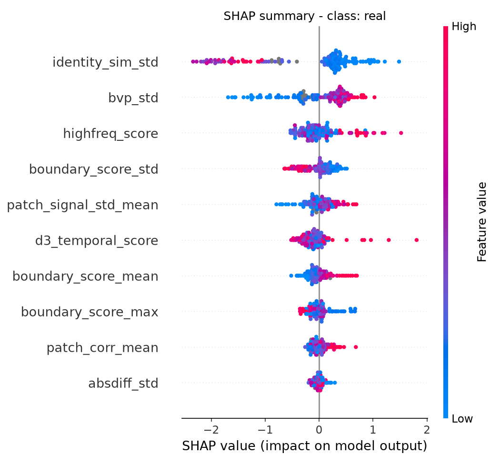
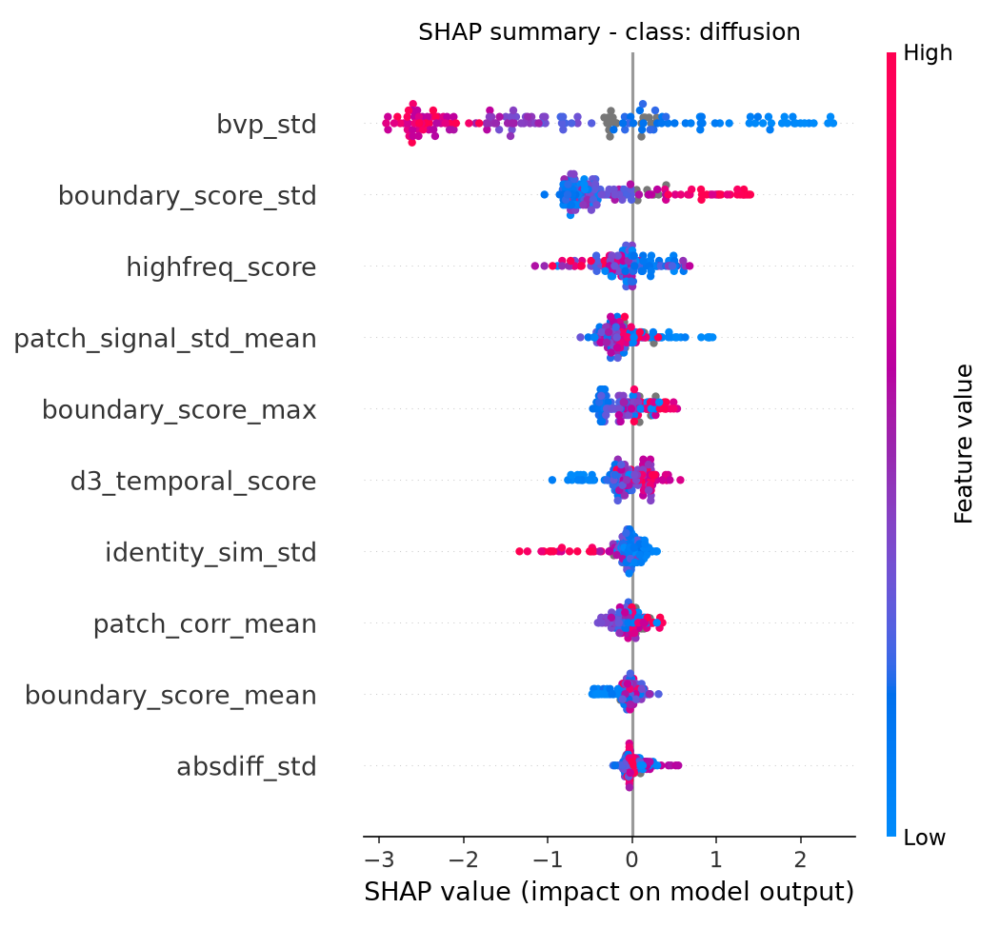
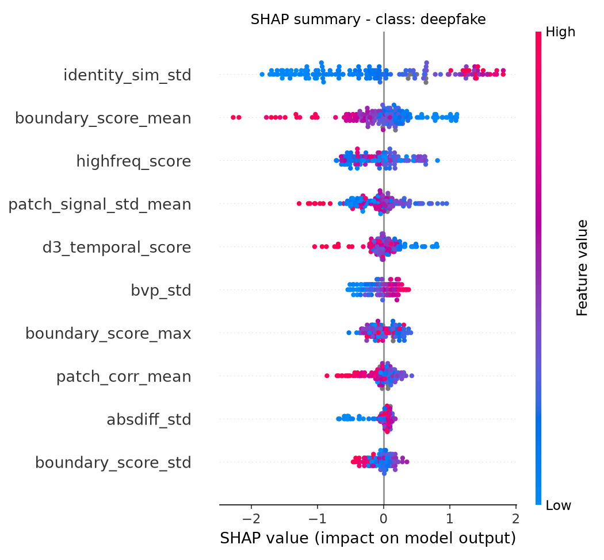

# train_classifier4 Experiment Results

생성 시각: 2026-09-13 22:56:06

## 1. Experiment Setup

- Task: Real / Deepfake / Diffusion 3-class Classification
- Dataset: `results/unified_features_20260911_024351.csv`
- Model: XGBoost (multi:softprob, n_estimators=300, max_depth=4, lr=0.05)
- Class Weight: balanced sample weight
- Feature Selection Metric: Macro F1 (tie-break tolerance = 0.005, 동률이면 더 적은 피처 선택)
- Feature Selection Method: boundary/identity 계열 전체 부분집합 완전 탐색 (train 내부 5-Fold CV)
- Validation Method: 5-Fold Stratified Cross Validation (train set 내부)
- Test Set: 피처 선택 이후 최종 평가에만 1회 사용
- Excluded Features: `pseudo_snr_db`
- Total Samples: 800
- Train / Test: 640 / 160

클래스별 샘플 수

| Class | Total | Train | Test |
|---|---:|---:|---:|
| Real | 335 | 268 | 67 |
| Deepfake | 248 | 198 | 50 |
| Diffusion | 217 | 174 | 43 |

## 2. Initial Features

### Base Features (6)

- absdiff_std
- bvp_std
- d3_temporal_score
- highfreq_score
- patch_corr_mean
- patch_signal_std_mean

### Boundary Features (3)

- boundary_score_mean
- boundary_score_std
- boundary_score_max

### Identity Features (3)

- identity_sim_mean
- identity_sim_std
- identity_sim_min

## 3. Boundary Feature Selection

Base feature 고정, boundary 후보의 모든 조합을 train CV 로 비교한 결과입니다.

| selected_features | n_group_features | n_total_features | accuracy | precision | recall | macro_f1 | macro_auc | weighted_auc | is_selected |
|---|---:|---:|---:|---:|---:|---:|---:|---:|---:|
| (none) | 0 | 6 | 0.6687 | 0.6717 | 0.6759 | 0.6729 | 0.8275 | 0.8202 | False |
| boundary_score_mean | 1 | 7 | 0.6906 | 0.6911 | 0.6976 | 0.6934 | 0.8510 | 0.8437 | False |
| boundary_score_std | 1 | 7 | 0.6828 | 0.6847 | 0.6916 | 0.6870 | 0.8502 | 0.8432 | False |
| boundary_score_max | 1 | 7 | 0.6672 | 0.6690 | 0.6792 | 0.6728 | 0.8457 | 0.8385 | False |
| boundary_score_mean + boundary_score_std | 2 | 8 | 0.7156 | 0.7155 | 0.7237 | 0.7187 | 0.8728 | 0.8666 | False |
| boundary_score_mean + boundary_score_max | 2 | 8 | 0.7063 | 0.7055 | 0.7147 | 0.7088 | 0.8692 | 0.8633 | False |
| boundary_score_std + boundary_score_max | 2 | 8 | 0.6969 | 0.6968 | 0.7088 | 0.7005 | 0.8565 | 0.8506 | False |
| boundary_score_mean + boundary_score_std + boundary_score_max | 3 | 9 | 0.7297 | 0.7291 | 0.7385 | 0.7325 | 0.8753 | 0.8692 | True |

### Selected Boundary Features

- boundary_score_mean
- boundary_score_std
- boundary_score_max

### Removed Boundary Features

- (없음)

## 4. Identity Feature Selection

Base feature + 선택된 boundary feature 를 고정하고 identity 후보 조합을 비교한 결과입니다.

| selected_features | n_group_features | n_total_features | accuracy | precision | recall | macro_f1 | macro_auc | weighted_auc | is_selected |
|---|---:|---:|---:|---:|---:|---:|---:|---:|---:|
| (none) | 0 | 9 | 0.7297 | 0.7291 | 0.7385 | 0.7325 | 0.8753 | 0.8692 | False |
| identity_sim_mean | 1 | 10 | 0.7328 | 0.7339 | 0.7432 | 0.7378 | 0.8905 | 0.8847 | False |
| identity_sim_std | 1 | 10 | 0.7625 | 0.7614 | 0.7683 | 0.7643 | 0.8991 | 0.8942 | True |
| identity_sim_min | 1 | 10 | 0.7562 | 0.7555 | 0.7625 | 0.7585 | 0.8987 | 0.8935 | False |
| identity_sim_mean + identity_sim_std | 2 | 11 | 0.7609 | 0.7618 | 0.7669 | 0.7641 | 0.8996 | 0.8942 | False |
| identity_sim_mean + identity_sim_min | 2 | 11 | 0.7453 | 0.7469 | 0.7518 | 0.7492 | 0.8981 | 0.8925 | False |
| identity_sim_std + identity_sim_min | 2 | 11 | 0.7547 | 0.7543 | 0.7614 | 0.7574 | 0.9000 | 0.8951 | False |
| identity_sim_mean + identity_sim_std + identity_sim_min | 3 | 12 | 0.7578 | 0.7575 | 0.7644 | 0.7605 | 0.9031 | 0.8978 | False |

### Selected Identity Features

- identity_sim_std

### Removed Identity Features

- identity_sim_mean
- identity_sim_min

## 5. Final Selected Features

### Base

- absdiff_std
- bvp_std
- d3_temporal_score
- highfreq_score
- patch_corr_mean
- patch_signal_std_mean

### Boundary

- boundary_score_mean
- boundary_score_std
- boundary_score_max

### Identity

- identity_sim_std

**총 feature 수: 10개** (후보 12개 중)

## 6. Final Model Performance (test set)

| Metric | Score |
|---|---:|
| Accuracy | 0.7875 |
| Macro Precision | 0.7940 |
| Macro Recall | 0.7902 |
| Macro F1 | 0.7894 |
| Weighted Precision | 0.7905 |
| Weighted Recall | 0.7875 |
| Weighted F1 | 0.7866 |
| Macro AUC | 0.9058 |
| Weighted AUC | 0.9011 |

## 7. Per-Class Performance

| class | precision | recall | f1_score | support |
|---|---:|---:|---:|---:|
| Real | 0.7812 | 0.7463 | 0.7634 | 67 |
| Deepfake | 0.7586 | 0.8800 | 0.8148 | 50 |
| Diffusion | 0.8421 | 0.7442 | 0.7901 | 43 |
| Macro Avg | 0.7940 | 0.7902 | 0.7894 | 160 |
| Weighted Avg | 0.7905 | 0.7875 | 0.7866 | 160 |

```text
              precision    recall  f1-score   support

        Real      0.781     0.746     0.763        67
    Deepfake      0.759     0.880     0.815        50
   Diffusion      0.842     0.744     0.790        43

    accuracy                          0.787       160
   macro avg      0.794     0.790     0.789       160
weighted avg      0.791     0.787     0.787       160
```

## 8. Confusion Matrix

| Actual \ Predicted | Real | Deepfake | Diffusion |
|---|---:|---:|---:|
| Real | 50 | 11 | 6 |
| Deepfake | 6 | 44 | 0 |
| Diffusion | 8 | 3 | 32 |


## 9. SHAP Feature Importance

| rank | feature | mean_abs_shap |
|---|---:|---:|
| 1 | bvp_std | 0.6978 |
| 2 | identity_sim_std | 0.6016 |
| 3 | boundary_score_std | 0.3071 |
| 4 | highfreq_score | 0.2778 |
| 5 | patch_signal_std_mean | 0.2368 |
| 6 | boundary_score_mean | 0.2311 |
| 7 | d3_temporal_score | 0.1926 |
| 8 | boundary_score_max | 0.1776 |
| 9 | patch_corr_mean | 0.1292 |
| 10 | absdiff_std | 0.0943 |


### 클래스별 mean |SHAP|

| feature | mean_abs_shap_real | mean_abs_shap_diffusion | mean_abs_shap_deepfake | mean_abs_shap_overall |
|---|---:|---:|---:|---:|
| bvp_std | 0.4771 | 1.4394 | 0.1770 | 0.6978 |
| identity_sim_std | 0.7628 | 0.1726 | 0.8695 | 0.6016 |
| boundary_score_std | 0.2064 | 0.5899 | 0.1250 | 0.3071 |
| highfreq_score | 0.2677 | 0.2526 | 0.3129 | 0.2778 |
| patch_signal_std_mean | 0.1898 | 0.2326 | 0.2880 | 0.2368 |
| boundary_score_mean | 0.1594 | 0.1215 | 0.4124 | 0.2311 |
| d3_temporal_score | 0.1895 | 0.2074 | 0.1808 | 0.1926 |
| boundary_score_max | 0.1449 | 0.2187 | 0.1694 | 0.1776 |
| patch_corr_mean | 0.1119 | 0.1236 | 0.1521 | 0.1292 |
| absdiff_std | 0.0637 | 0.0876 | 0.1315 | 0.0943 |





## 10. Before vs After Feature Selection

| Model | Feature Count | Accuracy | Macro F1 | Macro AUC |
|---|---:|---:|---:|---:|
| All Features | 12 | 0.8000 | 0.8008 | 0.9003 |
| Selected Features | 10 | 0.7875 | 0.7894 | 0.9058 |

## 11. Summary

- Boundary 계열에서는 `boundary_score_mean`, `boundary_score_std`, `boundary_score_max`가 최종 선택되었다.
- Identity 계열에서는 `identity_sim_std`가 최종 선택되었다.
- 전체 feature 수는 12개에서 10개로 감소하였다.
- test set Macro F1 은 전체 feature 모델 0.8008 에서 선택 feature 모델 0.7894 로 -0.0114 변화하였다.
- 최종 모델의 Accuracy 는 0.7875, Macro AUC 는 0.9058, Weighted AUC 는 0.9011 를 기록하였다.
- SHAP 분석에서 가장 영향력이 높은 feature 는 `bvp_std` (mean |SHAP| = 0.6978) 였다.
- 피처 축소로 test 성능이 다소 하락하였으므로, tol 값을 낮추거나 데이터를 늘려 재검토가 필요하다.
